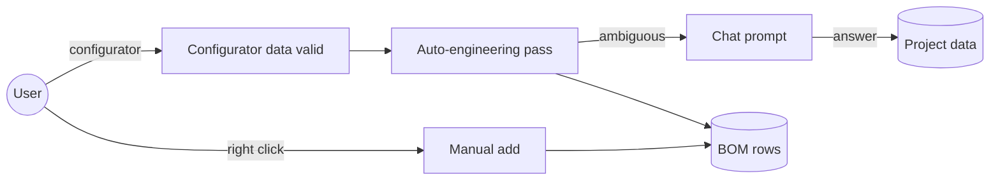

# Auto-engineering policy (“mouse feature”)

This document defines **how line items and fixture counts enter the BOM** so the **Design canvas**, **Configurator / Mechanical**, and **Project chat** stay aligned. Code should follow these rules; product/design reviews this doc before changing behavior.

## Three ways items are added or updated

### 1. Manual placement

- The user **right-clicks the canvas** (or equivalent) to add a fixture or architectural element.
- Manual placement is **always available** and does not replace code-driven sizing.
- **Canvas dot positions** stay manual / context-menu-driven; this policy governs **BOM quantities** and **when we ask the user** for a decision.

### 2. Auto-engineering pass

Runs when **pool volume** and **design GPM** are valid (same gating as the Engineering workspace).

The pass may set:

- **`wallReturns.qty`** and **`floorReturns.qty`** via `planInlets()` (fractional shelf area rule + `inletStrategy`).
- **`skimmers.qty`** from perimeter / pool use type (when implemented).
- **Pump / filter / heater** shortlist alignment (existing Engineering / equipment flows).

Auto-engineering **does not** silently override rows the user has **frozen** (see Precedence).

### 3. Chat prompt

Used only when an **auto default is not safe or not obvious**.

**Shipped in app**

1. **Sun shelf / super-shallow section** (`depth < 2 ft`, or type `wet-deck` / `bench`) **and** `inletStrategy === 'auto-shelf'` → chat asks floor vs wall returns; answer sets `inletStrategy` (`floor-only` / `wall-only`).

**Planned (not wired in chat yet)**

2. **Pool over 50,000 gal** and **`inletStrategy === 'wall-only'`** → confirm wall-only recirculation is intended.
3. **`expectedBuildDate`** more than **9 months** in the future → ask whether to **lock budgets** to today vs leave budgets as a rough estimate (hint only; no automatic cost change).

Prompts are **gated** (skip when conditions are false) and **persist** the user’s choice on first answer where implemented.

## Precedence

1. **Manual / explicit BOM edits** to a fixture row that participates in auto inlet counts (`wallReturns`, `floorReturns`) set **`autoEngineeringFrozen`** on that row until reset.
2. While **frozen**, auto-engineering **does not** change `qty` for that row.
3. **Reset** (e.g. “Re-apply auto inlet counts” in Mechanical) clears the freeze and re-runs `planInlets` for both rows.

## Flow (high level)

## Related implementation

- Inlet math: `src/data/inletPlanning.ts` (`planInlets`, `FLOW_PER_INLET_GPM`).
- Shelf / shallow detection: `src/data/poolSections.ts` (`isSuperShallowPoolSection`).
- Project setting: `ProjectData.inletStrategy` in **Mechanical → System knowledge** (not a new top-level wizard step).
