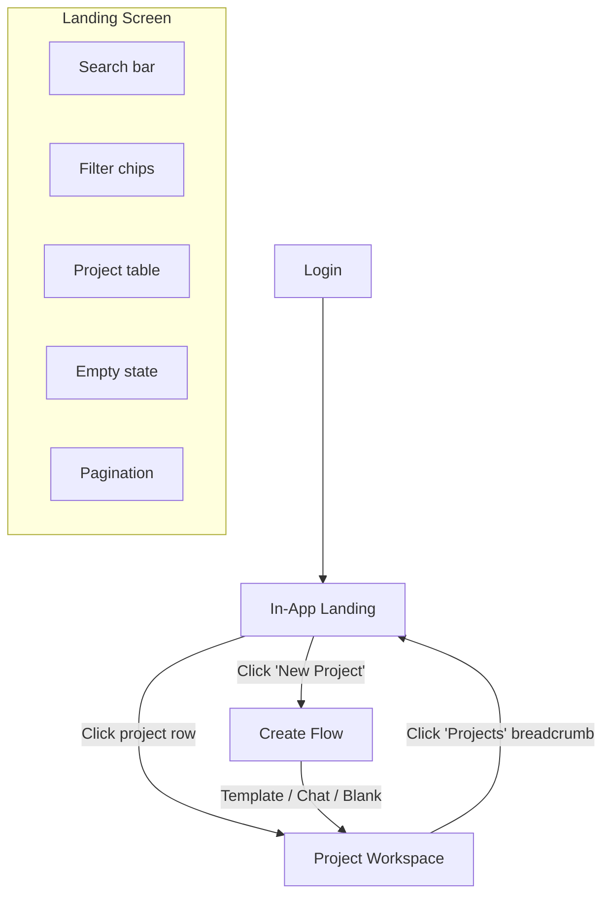

# In-App Landing Page — Project List

Design spec for the post-login landing screen. Addresses Travis's Apr 24 request: "landing page for app once you login — this should allow you to see projects, filterable by type, customer etc. and create new project." Also closes UX audit item **1.1** ("No way to start a new project from the interface"). See [docs/UX-UI-AUDIT.md](UX-UI-AUDIT.md).

---

## Current State

- `/#/app` drops the user straight into a hardcoded project (`DEFAULT_DATA` in [src/store.ts](../src/store.ts)) with no project selection step.
- A BackOffice `ProjectsList` exists at [src/components/BackOffice/ProjectsList.tsx](../src/components/BackOffice/ProjectsList.tsx) with status filter, search stub, project table, avatar stack, pagination, and empty state — but it lives inside the admin shell and cannot be reached from the `/#/app` route.
- Mock data: 6 projects in `MOCK_PROJECTS` ([src/components/BackOffice/mockProjects.ts](../src/components/BackOffice/mockProjects.ts)) with `projectType`, `poolType`, `client`, `status`, `team`, `deadline`, `configDone/configTotal`, `estimatedCost`, `dimensions`.

---

## Flow



### Entry Points

| From | How | Notes |
|------|-----|-------|
| Login / auth redirect | Default route `/#/app` now resolves to landing instead of a project | Requires new `wizardPhase: 'landing'` (or a separate route `/#/app/projects`) |
| Project workspace | "Projects" breadcrumb in TitleBar (see [docs/navigation-home.md](navigation-home.md)) | May trigger unsaved-changes confirm |
| BackOffice project list | "Open in Workspace" action already exists; continues to work | Opens directly into project workspace, skips landing |

---

## Layout

```
┌──────────────────────────────────────────────────────────────┐
│ TitleBar: Logo · "Projects" (active) · [theme] [settings]   │
├──────────────────────────────────────────────────────────────┤
│                                                              │
│  ┌────────────────────────────────────────────────────────┐  │
│  │ header row                                             │  │
│  │ ┌──────────────────────────────────┐  ┌─────────────┐ │  │
│  │ │ 🔍 Search projects...            │  │ + New Project│ │  │
│  │ └──────────────────────────────────┘  └─────────────┘ │  │
│  │                                                        │  │
│  │ filter chips                                           │  │
│  │ [All] [Residential] [Commercial] | [All Statuses ▾]    │  │
│  │ [All Customers ▾]                                      │  │
│  │                                                        │  │
│  │ project table                                          │  │
│  │ ┌─────────┬────────┬──────┬────────┬────────┬────────┐│  │
│  │ │ Project │ Client │Status│ Config │ Team   │Deadline││  │
│  │ ├─────────┼────────┼──────┼────────┼────────┼────────┤│  │
│  │ │ row     │        │      │ 8/13   │ ●●●    │ 5 days ││  │
│  │ │ row     │        │      │ 3/13   │ ●      │ 12 days││  │
│  │ │ ...     │        │      │        │        │        ││  │
│  │ └─────────┴────────┴──────┴────────┴────────┴────────┘│  │
│  │                                                        │  │
│  │ pagination                                             │  │
│  │ [< Prev] [1] [2] [3] [Next >]                         │  │
│  └────────────────────────────────────────────────────────┘  │
│                                                              │
├──────────────────────────────────────────────────────────────┤
│ StatusBar                                                    │
└──────────────────────────────────────────────────────────────┘
```

### TitleBar Adaptation

When on the landing screen:
- **Left:** Logo + "Projects" label (non-linked, since we're already there).
- **Center:** No workspace tabs (those belong to a project context).
- **Right:** Theme toggle + Settings only. No Save / Lock / Share / Templates (project-scoped actions hidden).

This mirrors the existing behavior where `wizardPhase !== 'workspace'` already hides workspace tabs and project actions in [src/components/TitleBar/TitleBar.tsx](../src/components/TitleBar/TitleBar.tsx).

---

## Search

- Full-width text input with search icon, placeholder "Search projects...".
- Filters against: `name`, `code`, `client`, `address`, `cityState`, `poolType`.
- Debounced (200 ms). Results update table in-place. No separate results view.
- Empty search = show all (filtered by chips).
- Search + chip filters are combinable (AND logic).

---

## Filter Chips

### v1 Filters

| Filter | Type | Source | Behavior |
|--------|------|--------|----------|
| Project type | Toggle chips | Distinct `projectType` values from projects (`Residential`, `Commercial`) | Click to toggle; "All" deselects specific types |
| Status | Dropdown select | `ProjectStatus` union from `mockProjects.ts` | Select one or "All Statuses" |
| Customer | Dropdown select | Distinct `client` values from projects | Select one or "All Customers" |

### Chip Rendering

- "All" chip: default selected, mutually exclusive with specific type chips.
- Type chips: `Residential`, `Commercial` (extend as new `projectType` values appear in data). Multiple selectable.
- Dropdown selects: `<select>` elements styled consistently with the BackOffice filter in `ProjectsList.tsx`.
- Active filter count badge on mobile if filters are collapsed (future).

### Clear

- When any non-default filter is active, show a "Clear filters" text button at the end of the chip row.

---

## Project Table

### Columns

| Column | Data source | Rendering |
|--------|-------------|-----------|
| **Project** | `name`, `code`, `avatarColor` | Color avatar (first letter of name) + project name (bold) + code below in muted text |
| **Client** | `client` | Plain text, `--text-secondary` |
| **Status** | `status` via `STATUS_META` | Colored dot + label (e.g., green dot + "In Progress") |
| **Config** | `configDone` / `configTotal` | Mini progress bar (same as BackOffice) + fraction text |
| **Team** | `team` | Avatar stack (max 3 shown + "+N" overflow), same as BackOffice `AvatarStack` |
| **Deadline** | `deadline` | Plain text, `--text-muted`; if ≤2 days, use `--warning` color |

### Row Interaction

- Entire row is clickable (`role="button"`, `tabIndex={0}`).
- Hover: `background: var(--bg-hover)`.
- Click / Enter / Space: navigates to `/#/app/{workspace}` for that project, sets `wizardPhase: 'workspace'` and populates `data` from the selected project.
- No right-click context menu in v1.

### Sort

- Default: by `modified` descending (most recently active first).
- Clicking a column header toggles ascending/descending sort for that column.
- Sortable columns: Project (alphabetical by name), Status (by `lifecycleIndex`), Config (by completion %), Deadline (by days remaining).
- Active sort shown with a small arrow indicator in the column header.

---

## Empty State

When no projects match (either no data or filters exclude everything):

```
┌────────────────────────────────────────────┐
│                                            │
│         No projects found                  │
│                                            │
│   Create a project to get started,         │
│   or adjust your filters.                  │
│                                            │
│        [ + New Project ]                   │
│                                            │
└────────────────────────────────────────────┘
```

- Title: `--text-bright`, `--fs-md`, centered.
- Description: `--text-secondary`, `--fs-sm`, centered.
- CTA button: primary style (accent background, white text), same as BackOffice `primaryBtn`.
- If filters are active, also show "Clear filters" as a secondary link below the CTA.

---

## "New Project" Button

Top-right of the header row. Primary button style.

Click behavior: navigates to the existing project creation flow. Three options for where it routes (decision needed from Travis — captured in [docs/travis-apr24-decisions.md](travis-apr24-decisions.md)):

| Option | Route | Existing support |
|--------|-------|------------------|
| **A. Source picker** | `wizardPhase: 'template'` → `WorkspaceLanding` | Already built — template / existing project / chat |
| **B. Direct to chat** | `wizardPhase: 'chat'` → `ProjectChat` | Already built |
| **C. Blank project** | `wizardPhase: 'workspace'` with `DEFAULT_DATA` | Already built |

**Recommendation:** Option A (source picker), since it lets the user choose their preferred starting method and is already fully functional.

---

## Pagination

- Reuse the BackOffice pagination pattern (Previous / page numbers / Next).
- Page size: 10 projects per page (reasonable for mock data; configurable later).
- If total projects ≤ page size, hide pagination entirely.

---

## Responsive Behavior

- Table stays full-width down to 768 px. Below that (future), consider switching to a card layout.
- Search bar and "New Project" button stack vertically on narrow viewports.
- Filter chips wrap naturally (flexbox).

---

## State & Routing

### New State

Two options for implementation (Brett's call):

**Option 1 — New `wizardPhase` value:**

Add `'landing'` to the `WizardPhase` union in [src/types.ts](../src/types.ts):

```typescript
export type WizardPhase = 'landing' | 'chat' | 'template' | 'wizard' | 'workspace';
```

`INITIAL_STATE.wizardPhase` changes from `'template'` to `'landing'`. The landing screen renders when `wizardPhase === 'landing'`.

**Option 2 — Hash route:**

Add `/#/app/projects` as a distinct route in [src/main.tsx](../src/main.tsx). Landing is a separate component, not gated by `wizardPhase`.

**Recommendation:** Option 1 (wizardPhase) because it keeps the flow linear and uses the existing reducer pattern. No new routing needed.

### New Action

```typescript
| { type: 'OPEN_PROJECT'; projectId: string }
| { type: 'RETURN_TO_LANDING' }
```

`OPEN_PROJECT`: loads project data into `state.data`, sets `wizardPhase: 'workspace'`, sets `activeWorkspace: 'configurator'`.

`RETURN_TO_LANDING`: sets `wizardPhase: 'landing'`, clears project-specific state. See [docs/navigation-home.md](navigation-home.md) for unsaved-changes behavior.

---

## Files Brett Touches

| File | Change |
|------|--------|
| `src/types.ts` | Add `'landing'` to `WizardPhase`; add `OPEN_PROJECT` and `RETURN_TO_LANDING` actions |
| `src/store.ts` | Change `INITIAL_STATE.wizardPhase` to `'landing'`; add reducer cases for new actions |
| `src/App.tsx` | Render landing component when `wizardPhase === 'landing'` |
| `src/components/ProjectsLanding/ProjectsLanding.tsx` | **New file** — the landing screen component |
| `src/components/ProjectsLanding/ProjectsLanding.module.css` | **New file** — styles (reuse token values from `theme.css`) |
| `src/components/TitleBar/TitleBar.tsx` | Adapt left section and hide workspace tabs when on landing |
| `src/components/BackOffice/mockProjects.ts` | No change — data is reused as-is via import |

### Reuse from BackOffice

The following patterns from `ProjectsList.tsx` should be extracted or copied:

- `AvatarStack` component (move to `src/components/ui/AvatarStack.tsx` for sharing)
- `STATUS_META` color/label mapping (already importable from `mockProjects.ts`)
- Table structure and row click handling
- Empty state layout
- Pagination controls
