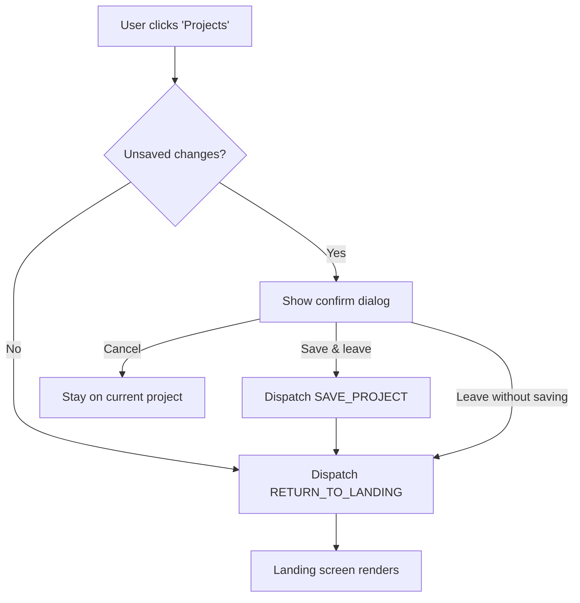

# Navigation Home — Breadcrumb Pattern

Design spec for the "ability to navigate to landing page" requested by Travis (Apr 24). Provides a persistent, visible affordance to return to the project list from anywhere within a project workspace.

---

## Current State

[src/components/TitleBar/TitleBar.tsx](../src/components/TitleBar/TitleBar.tsx) renders:

```
[Logo] › Project Name [FINALIZED badge]    [workspace tabs]    [Save][Lock][Share][Theme][Settings]
```

- `NorveoLogo` is a static SVG — not clickable, no hover state.
- `ChevronRight` is a visual separator, not interactive.
- The project name is plain text, not a link.
- There is no way to leave a project and return to a list. Once `wizardPhase === 'workspace'`, the user is stuck.

---

## Pattern Comparison

### Option 1 — Clickable Logo

Make the `NorveoLogo` a click target that navigates to the landing page.

| Pro | Con |
|-----|-----|
| Zero new UI elements | Ambiguous — does it go to landing? to Portal? to a marketing page? |
| Industry convention (Google Docs, Figma) | Invisible affordance for new users; no text label |
| Smallest change | Tooltip-dependent for discoverability |

### Option 2 — Breadcrumb Pill (recommended)

Replace the `Logo › ProjectName` segment with a breadcrumb:

```
[Logo]  Projects › Hillcrest Aquatic Center    [workspace tabs]    [actions]
```

- "Projects" is a clickable text link that returns to the landing page.
- "Hillcrest Aquatic Center" remains the project name (non-linked — you're already there).
- The `ChevronRight` separator (`›`) stays as a visual hierarchy cue.

| Pro | Con |
|-----|-----|
| Explicit label — zero ambiguity | Takes slightly more horizontal space (~60 px for "Projects") |
| Discoverable without tooltip | Breadcrumb pattern may suggest deeper nesting (though we only have 2 levels) |
| Keyboard-accessible link | — |
| Familiar to users of Jira, Linear, Notion | — |

**Recommendation: Option 2.** The explicit "Projects" label is immediately understandable. The space cost is negligible — the left section of the TitleBar has room (project name already truncates at 28 chars via the `truncate()` utility).

---

## Visual Spec

### Landing Screen (no project open)

```
[Logo]  Projects                               [Theme] [Settings]
```

- "Projects" is plain text (non-linked) — you're on the landing, nowhere to navigate back to.
- No workspace tabs, no project actions. Already handled by the existing `wizardPhase !== 'workspace'` guard.

### Project Workspace

```
[Logo]  Projects › Hillcrest Aquatic Center    [workspace tabs]    [Save][Lock]...
```

- `[Logo]`: static, not clickable (keeps it as pure branding, avoids dual-purpose confusion with "Projects" link right next to it).
- `Projects`: clickable link. Returns to landing.
- `›`: `ChevronRight` icon at 11 px (existing), `--text-muted` color.
- `Hillcrest Aquatic Center`: current project name, `--text-primary`, truncated at 28 chars.

### States for "Projects" Link

| State | Style |
|-------|-------|
| Default | `color: var(--text-secondary); font-size: var(--fs-base); cursor: pointer` |
| Hover | `color: var(--text-accent); text-decoration: underline` |
| Focus-visible | Standard focus ring (`outline: 2px solid var(--accent); outline-offset: 2px`) |
| Active (mousedown) | `color: var(--accent-hover)` |
| Disabled | N/A — the link is always available when a project is open |

### Element

```tsx
<a
  className={styles.breadcrumbLink}
  href="#"
  onClick={(e) => {
    e.preventDefault();
    handleReturnToLanding();
  }}
  aria-label="Return to project list"
>
  Projects
</a>
```

Not a `<button>` — semantically this is navigation, so an anchor is appropriate. The `href="#"` is a fallback; the click handler does the actual state transition.

---

## Behavior

### Click Flow



### Unsaved Changes Detection

For v1, "unsaved" is defined as: the project `data` object has been modified since the last `SAVE_PROJECT` action (or since project load if never saved). Implementation options:

- **Simple:** Track a `lastSavedData: ProjectData | null` snapshot in state. Compare current `data` to `lastSavedData` via shallow key comparison.
- **Simpler:** Track a boolean `isDirty` flag, set to `true` on any `UPDATE_DATA` action, reset to `false` on `SAVE_PROJECT`.

**Recommendation:** `isDirty` boolean. Minimal state, easy to implement, avoids deep comparison.

### Confirm Dialog

Native `window.confirm()` is acceptable for v1. Copy:

> "You have unsaved changes. Save before leaving?"
>
> [Save & Leave] [Leave Without Saving] [Cancel]

If a custom modal is preferred, reuse the modal pattern from the project wizard (focus trap, Escape to cancel, return focus to trigger on dismiss).

### Finalized Projects

If `data.isFinalized === true`, there are no unsaved changes by definition (edits are blocked). Skip the confirm dialog — navigate immediately.

### Design Mode (Canvas)

The Design workspace has additional transient state (tool selection, viewport position). None of this is persisted today, so it's not "unsaved" in the data sense. No special handling needed — the confirm dialog only cares about `ProjectData`.

---

## Reducer Action

```typescript
{ type: 'RETURN_TO_LANDING' }
```

Handler in [src/store.ts](../src/store.ts):

```typescript
case 'RETURN_TO_LANDING':
  return {
    ...state,
    wizardPhase: 'landing',
    activeStep: null,
    configDrawerOpen: false,
    activeWorkspace: 'configurator',
    // Optionally clear project data or keep it cached for "back" behavior
  };
```

Whether to clear `state.data` on return is a product decision. Keeping it cached means the user can navigate back to the same project without reloading. Clearing it means a clean slate. **Recommendation:** keep it cached; the `OPEN_PROJECT` action overwrites it when a different project is selected.

---

## Keyboard

| Key | Context | Behavior |
|-----|---------|----------|
| Tab | TitleBar | "Projects" link is in the natural tab order, between logo and project name |
| Enter | "Projects" link focused | Triggers click flow (dirty check → navigate) |
| Escape | Confirm dialog open | Cancels (stays on project) |

---

## Files Brett Touches

| File | Change |
|------|--------|
| `src/components/TitleBar/TitleBar.tsx` | Replace `ChevronRight` + static project name with breadcrumb structure; add "Projects" link with click handler; add `handleReturnToLanding` with dirty check |
| `src/components/TitleBar/TitleBar.module.css` | Add `.breadcrumbLink` styles (hover, focus, active states) |
| `src/types.ts` | Add `'landing'` to `WizardPhase` (shared with landing-page spec); add `RETURN_TO_LANDING` to `AppAction` |
| `src/store.ts` | Add `isDirty: boolean` to `AppState`; set `true` on `UPDATE_DATA`, `false` on `SAVE_PROJECT`; add `RETURN_TO_LANDING` reducer case |
| `src/App.tsx` | Render landing component when `wizardPhase === 'landing'` (shared with landing-page spec) |

---

## Relationship to Other Specs

- **[docs/landing-page.md](landing-page.md)**: defines _what_ the user lands on after clicking "Projects". This spec defines _how they get there_.
- **[docs/travis-apr24-decisions.md](travis-apr24-decisions.md)**: captures the open question about whether to keep project data cached or clear it on return.
